=================================================
LabJack: Driver for T-series Devices From LabJack
=================================================

:author: Mark Rivers, University of Chicago

.. contents:: Contents

.. _EPICS:                 https://epics-controls.org/
.. _asyn:                  https://github.com/epics-modules/asyn
.. _LabJackCorp:           https://www.labjack.com
.. _asynPortDriver:        https://epics-modules.github.io/master/asyn/R4-42/asynPortDriver.html

Introduction
------------

This is an EPICS_ driver for the
T-series devices from LabJackCorp_.
These multi-function devices support support analog input, 
thermocouple input, analog output, and binary I/O.

The driver is written in C++, and consists of a class that inherits from
asynPortDriver_, which is part of the EPICS asyn_ module.

The driver is written to be general, so that it can be used with any
LabJack T-series module. The T-series devices all use Modbus for the low-level
communications, and use a consistent set of Modbus register addresses, so the
code is largely model-independent.  The driver does require small modifications
to be be used with a new model.

Supported models
----------------

All LabJack T-series modules have both Ethernet and USB communications.  The following models are currently supported.

T4
~~

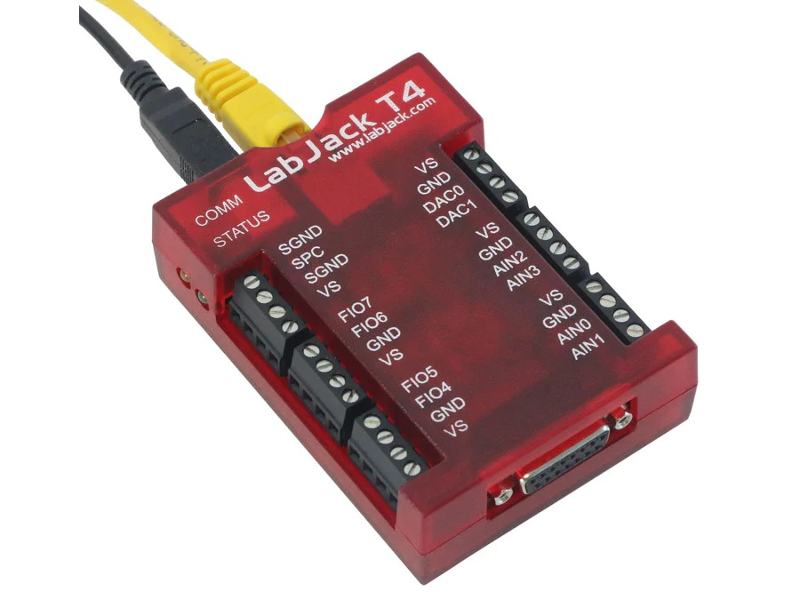

    **Photo of LabJack-T4**

This module costs $245 and has the following features:

-  4 single-ended analog inputs

   -  +- 10V range
   -  12-bit
   -  Up to 50 kHz total streaming input rate, i.e. 1 channel at 50 kHz, 2 channels at 25 kHz, etc.

-  Up to 8 additional analog inputs (0-2.5 V range, 12-bit).  These can also be configured as digital I/O bits.

-  2 analog outputs

   -  0-5V range
   -  10-bit
   -  Up to 50 kHz streaming output rate

-  20 digital I/O bits

   -  Each configurable as input or output. 
   -  8 of these can configured as 0-2.5V analog inputs.

More information can be found in the `T4 product description.
<https://labjack.com/products/labjack-t4>`__

T7
~~

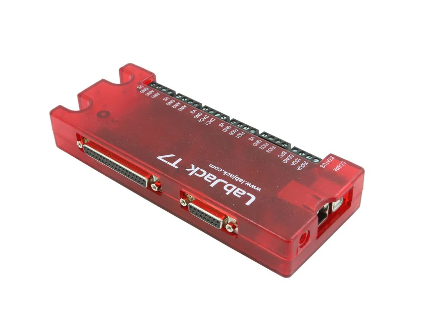

    **Photo of LabJack-T7**

This module costs $520 and has the following features:

-  14 single-ended / 7 differential analog inputs

   - Programmable range (+-10V, +-1V, +-0.1V, +-0.01V)
   - 16-bit
   - Up to 100 kHz total streaming input rate, i.e. 1 channel at 100 kHz, 2 channels at 50 kHz, etc.

-  2 analog outputs

   - 0-5V range
   - 12-bit
   - Up to 100 kHz streaming output rate

-  23 digital I/O bits
   - Each configurable as input or output.

More information can be found in the `T7 product description.
<https://labjack.com/products/t7>`__

T7-PRO
~~~~~~

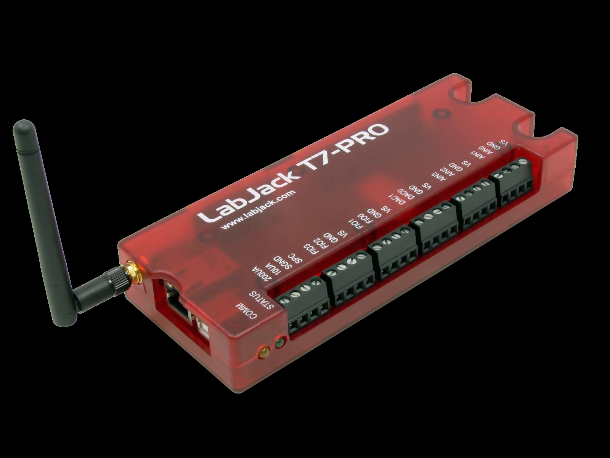

    **Photo of LabJack T7-PRO**

This module costs $750 and is the same as the LabJack T7 with the following additional features:

-  Each analog input can be software switched between 16-bit and 24-bit ADC, trading off resolution for speed.
-  In 24-bit mode the ADCs support 9 types of thermocouple inputs.
-  WiFi communications (in addition to standard Ethernet and USB).

More information can be found in the `LabJack T7-PRO product description.
<https://labjack.com/products/labjack-t7-pro>`__

T8
~~

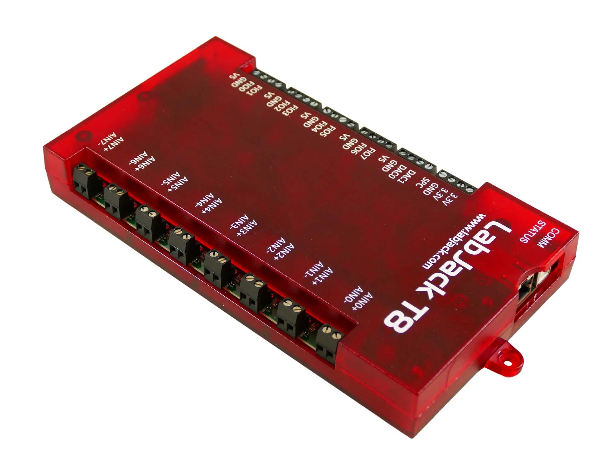

    **Photo of LabJack T8**

This module costs $1,400 and has the following features:

-  8 differential analog inputs

   - 11 input ranges from +-11V to +-0.15 V
   - 24-bit sigma/delta ADC
   - Supports 9 types of thermocouple inputs
   - Up to 40 kHz streaming input per channel, i.e. up to 320 kHz total scanning rate.

-  2 analog outputs

   - 0-10V range
   - 16-bit
   - Up to 40 kHz streaming output rate

-  23 digital I/O bits, each configurable as input or output.

More information can be found in the `LabJack T8 product description. 
<http://labjack.com/products/t8>`__

Installation
------------
The EPICS LabJack module uses the 
`LJM library <https://labjack.com/pages/support?doc=/software-driver/ljm-users-guide/>`__ 
from LabJack.  It runs on Linux and Windows.  

Most Linux versions should be supported.  It has been tested on Centos 7.  
The EPICS module includes the LJM header and library files, so ideally
LJM would not need to be installed locally on Linux.  
However, LJM uses configuration files which it installs in /usr/local/share/LabJack/LJM,
so the LJM package does need to be installed, and this requires root privilege.
I have asked LabJack support if it is possible for those files to be located 
in a directory that does not require root permission to write to.

On Windows the LJM library package needs to be installed to run the IOC.

Driver architecture
-------------------
The driver has a polling thread that periodically reads the state of the
digital I/O bits and the values of the analog inputs.  If the waveform
digitizer or waveform generator functions are active it polls the status
of those as well.  
The delay time at the end of the polling cycle can be controlled via an EPICS PV.
The actual poll cycle time, including the delay, is reported in an EPICS PV.

The digital I/O are normally set to SCAN=I/O Intr so that they change state quickly
when the poller reads them.

The analog inputs can be set to either periodic or I/O Intr scan.  I/O Intr scan
allows more frequent updates at the expense of CPU load and Channel Access traffic.

When reading analog inputs in thermocouple mode the inputs are actually read in volts,
and the conversion to temperature is done in software.  This uses the cold junction
temperature read from the device, and the temperature conversion function in the LJM library.
This allows temperature inputs to be scanned with the waveform digitizer function, which is
not possible if the temperature conversions are performed on the device itself.

Configuration
-------------

The following lines are needed in the EPICS startup script for the LabJack driver.

::

   ## Configure port driver
   # LabJackConfig(portName,        # The name to give to this asyn port driver
   #               uniqueID,        # The IP name, IP address, or serial number of the LabJack module.
   #               maxInputPoints,  # Maximum number of input points for waveform digitizer
   #               maxOutputPoints) # Maximum number of output points for waveform generator
   LabJackConfig("LJT7_1", "gse-labjack1.cars.aps.anl.gov, 2048, 2048)

The uniqueID is a string that identifies the device to be controlled.  It can be any of the following:

- A fully qualified domain name with periods, e.g. gse-labjack1.cars.aps.anl.gov.
  The periods are needed to distinguish an IP name from a serial number.
- An IP address, e.g. 10.54.160.72.
- A module serial number, e.g. 470029169.

The LabJack module comes with example iocBoot/ directories that contain
example startup scripts and example substitutions files for each model.

Top-level OPI screen
--------------------
The following it the top-level medm screen for the LabJack T7 and T7-PRO modules.

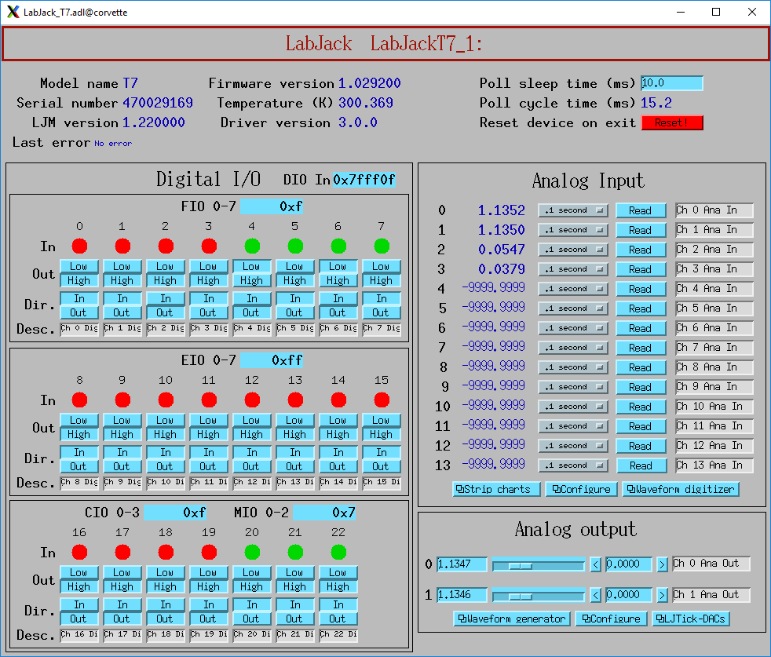

    **LabJack_T7.adl**

While this screen is nominally specific to the T7 and T7-PRO, it can be used for any model. 
On the T8 analog inputs 8-13 do not apply.
On the T4 analog inputs 12-13 do not apply, nor do digital I/O bits 20-22.

Databases
---------

The following tables list the database template files that are used with the LabJack modules.

Device Functions
~~~~~~~~~~~~~~~~

These are the records defined in LabJack_device.template.
These records provide device-wide information and control.
This database is loaded once for each LabJack device.

.. cssclass:: table-bordered table-striped table-hover
.. list-table::
  :header-rows: 1
  :widths: 10 10 10 10 60
  :align: left

  * - EPICS record name
    - EPICS record type
    - asyn interface
    - drvInfo string
    - Description
  * - $(P)ModelName
    - mbbi
    - asynInt32
    - MODEL_NAME
    - Device model name. mbbi values and strings are

      - 0="T4"
      - 1="T7"
      - 2="T7-Pro"
      - 3="T8".
  * - $(P)FirmwareVersion
    - stringin
    - asynOctet
    - FIRMWARE_VERSION
    - Device firmware version.
  * - $(P)SerialNumber
    - stringin
    - asynOctet
    - SERIAL_NUMBER
    - Device serial number.
  * - $(P)DeviceTemperature
    - ai
    - asynFloat64
    - DEVICE_TEMPERATURE
    - Device temperature. This is used as the cold junction reference temperature for thermocouple measurements.
      It has SCAN="5 second" which is fast enough for this slowly varying value.
  * - $(P)LJMVersion
    - stringin
    - asynOctet
    - LJM_VERSION
    - Version of the LabJack LJM library.
  * - $(P)DriverVersion
    - stringin
    - asynOctet
    - DRIVER_VERSION
    - Version of the EPICS driver.
  * - $(P)LastErrorMessage
    - waveform
    - asynOctet
    - LAST_ERROR_MESSAGE
    - The last error message from the driver. This includes a timestamp.
  * - $(P)PollSleepMS
    - ao
    - asynFloat64
    - POLL_SLEEP_MS
    - The number of milliseconds to sleep at the end of each poll cycle.
  * - $(P)PollTimeMS
    - ai
    - asynFloat64
    - POLL_TIME_MS
    - The actual number of milliseconds to execute the poll cycle, including the sleep.
  * - $(P)AiAllSettlingUS
    - ao
    - asynFloat64
    - ANALOG_IN_SETTLING_TIME_ALL
    - Selects the settling time for all analog input channels.
  * - $(P)AiAllResolution
    - mbbo
    - asynInt32
    - ANALOG_IN_RESOLUTION_ALL
    - High values of resolution result in lower noise and longer ADC conversion time.
      Resolution 0 is the default resolution for that model.

      - The T4 supports resolutions 1-5.
      - The T7 supports resolutions 1-8.
      - The T7-PRO supports resolutions 1-12. 1-8 use the 16-bit ADC and 9-12 use the 24-bit ADC. 
        When running the waveform generator on the T7-PRO this must be set to values between 1-8, i.e. 16-bit ADC.
        The driver will set this automatically when starting the waveform generator if it is outside the allowed range.
      - The T8 supports resolutions 1-16.  However, it is recommended to use the default resolution and change the SamplingRate
        to control the resolution vs speed tradeoff.
  * - $(P)AiSamplingRate
    - ao
    - asynFloat64
    - ANALOG_IN_SAMPLING_RATE
    - This sets the sampling rate of the ADC in Hz.  

      - It applies to the T8 only.
      - Recommended range is 100 to 10000 Hz.  
      - Lower rates do more filtering in the ADC, reducing noise at the expense of speed.
      - Increasing the sampling rate will increase the noise in each reading.  
      - However, since the analog input records use the devAsynFloat64Average device support, 
        increasing the rate can increase the number of samples averaged in the EPICS device support in a fixed period of time,
        provided it is not limited by PollSleepMS.
      - Because of this averaing in device support, increasing the sampling time from 100 Hz to 1000 Hz can actually result in a 
        small decrease in noise.
      - The maximum rate that the values can be read from the device with PollSleepMS=0 is about 2000/s, so increasing the 
        SamplingRate beyond 2000 will not result more averaging in EPICS device support.
  * - $(P)DeviceReset
    - bo
    - asynInt32
    - DEVICE_RESET
    - Processing this record sets the device watchdog time to 10 s, and the watchdog timer function to device reset.
      This will reset the device after 10 seconds of communications inactivity.  
      Processing this record, exiting the IOC application, and waiting at least 10 seconds will cause the device to reset.
      This can be used to remotely recover from a device malfunction that requires a reset.
      Note that the device will continue to reset every 10 seconds until the IOC successfully starts again.
      The IOC may occasionally fail to start after a DeviceReset because the device is currently resetting.  Trying again will eventually succeed.

Analog Input Functions
~~~~~~~~~~~~~~~~~~~~~~

These are the records defined in LabJack_ai.template.
This database is loaded once for each analog input channel

.. cssclass:: table-bordered table-striped table-hover
.. list-table::
  :header-rows: 1
  :widths: 10 10 10 10 60
  :align: left

  * - EPICS record name
    - EPICS record type
    - asyn interface
    - drvInfo string
    - Description
  * - $(P)Ai$(N)
    - ai
    - asynFloat64
    - ANALOG_IN_VALUE
    - Analog input value. This is polled in the driver, so either period or
      I/O Intr scanning can be used.
  * - $(P)AiEnable$(N)
    - bo
    - asynInt32
    - ANALOG_IN_ENABLE
    - Enable flag for this analog input channel. Disabled inputs are not read by the poller.
      Unconnected inputs should be disabled to improve accuracy on active channels and to
      reduce the polling time.
  * - $(P)AiMode$(N)
    - mbbo
    - asynInt32
    - ANALOG_IN_MODE
    - Input mode for this analog input channel. Choices are Volts and 9 different thermocouple types.
  * - $(P)AiTempUnits$(N)
    - mbbo
    - asynInt32
    - TEMPERATURE_UNITS
    - Temperature units for this analog input channel if a thermocouple mode is selected.
      Choices are "K", "C", and "F".
  * - $(P)AiDiff$(N)
    - mbbo
    - asynInt32
    - ANALOG_IN_DIFF
    - Selects "Single-Ended" or "Differential" input mode on the T7 and T7-PRO.
      The T4 is always single-ended and the T8 is always differential.
      The driver constructs the strings and values based on the model.
  * - $(P)AiRange$(N)
    - mbbo
    - asynInt32
    - ANALOG_IN_RANGE
    - Selects the input range for this analog input channel.

      - On the T4 the range is fixed at +-10V on channels 0-3 and 0-2.5 on channels 4-11.
      - On the T7 the range choices are +-10V, +-1V, +-0.1V, and +-0.01V.
      - On the T8 there are 11 ranges from +-11V to +-0.15V.

      The driver constructs the strings and values based on the model.
  * - $(P)AiResolution$(N)
    - mbbo
    - asynInt32
    - ANALOG_IN_RESOLUTION
    - Selects the input resolution for this analog input channel. 
      High values of resolution result in lower noise and longer ADC conversion time.

      - Resolution 0 is the default resolution for that model.
      - The T4 supports resolutions 1-5.
      - The T7 supports resolutions 1-8.
      - The T7-PRO supports resolutions 1-12. 1-8 use the 16-bit ADC and 9-12 use the 24-bit ADC
      - The T8 supports resolutions 1-16.  However, these are automatically selected by the Range, and this record has no effect?

The following is the medm screen for controlling the analog input configuration records.

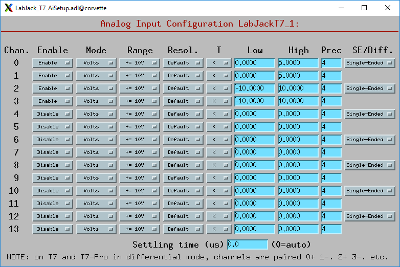

    **LabJack_T7_AiSetup.adl**

While this screen is nominally specific to the T7 and T7-PRO, it can be used for any model. 
On the T8 analog inputs 8-13 do not apply and the inputs are always in Differential mode.
On the T4 analog inputs 12-13 do not apply.  
Thermocouples only work well with the T7-PRO in 24-bit mode (resolutions 9-12), or with the T8 with low-voltage ranges. 
They do not work well with the T4 or T7.

Analog Output Functions
~~~~~~~~~~~~~~~~~~~~~~~

These are the records defined in LabJack_Ao.template.
This database is loaded once for each analog output channel

.. cssclass:: table-bordered table-striped table-hover
.. list-table::
  :header-rows: 1
  :widths: 10 10 10 10 60
  :align: left

  * - EPICS record name
    - EPICS record type
    - asyn interface
    - drvInfo string
    - Description
  * - $(P)$(R)
    - ao
    - asynFloat64
    - ANALOG_OUT_VALUE
    - Analog output value.
  * - $(P)$(R)TweakVal
    - ao
    - N.A.
    - N.A.
    - The amount by which to tweak the out when the Tweak record is processed.
  * - $(P)$(R)TweakUp
    - calcout
    - N.A.
    - N.A.
    - Tweaks the output up by TweakVal.
  * - $(P)$(R)TweakDown
    - calcout
    - N.A.
    - N.A.
    - Tweaks the output down by TweakVal.

The following is the medm screen for configuring the analog output
records. The drive limits can be more restrictive than the full output range of the analog outputs.

Channels 0 and 1 are the on-board DACs on all models.
The range is 0-5V for the on-board DACs on the T4, T7, and T7-PRO, and 0-10V on the T8.

Channels 2 and above are the LJTick DACs that can be optionally installed on any model.
The range on the LJTick DACs is +-10V.

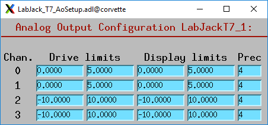

    **LabJack_T7_AoSetup.adl**

The following is the medm screen for controlling the optional LJTick DACs.

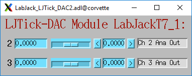

    **LabJack_LJTick_DAC2.adl**

Digital I/O Functions
~~~~~~~~~~~~~~~~~~~~~

These are the records defined in LabJack_binary.template and LabJack_biWord.template.

.. cssclass:: table-bordered table-striped table-hover
.. list-table::
  :header-rows: 1
  :widths: 10 10 10 10 60
  :align: left

  * - EPICS record name
    - EPICS record type
    - asyn interface
    - drvInfo string
    - Description
  * - $(P)Bi$(N)
    - bi
    - asynUInt32Digital
    - DIGITAL_IN_WORD
    - Digital input value. The MASK parameter in the INP link defines which bit is used.
      The binary inputs are polled by the driver poller thread, so these records should
      have SCAN="I/O Intr".
  * - $(P)Bo$(N)
    - bo
    - asynUInt32Digital
    - DIGITAL_OUT_BIT
    - Digital output value. The ADDR parameter in the INP link defines which bit is used.
  * - $(P)Bd$(N)
    - bo
    - asynUInt32Digital
    - DIGITAL_DIRECTION
    - Direction of this I/O line, "In" (0) or "Out" (1). The MASK parameter in the INP
      link defines which bit is used.
  * - $(P)$(R)
    - longin
    - asynUInt32Digital
    - DIGITAL_INPUT
    - Digital input value as a word, rather than individual bits. The ADDR parameter in the INP link
      defines which word is read. 0=DIO (bits 0-23), 1=FIO (bits 0-7), 2=EIO (bits 8-15), 3=CIO (bits 16-19), and 4=MIO (bits 20-22).
      The binary inputs are polled by the driver poller thread, so these records should have SCAN="I/O Intr".

Waveform Digitizer Functions
~~~~~~~~~~~~~~~~~~~~~~~~~~~~

These records are defined in the following files:
- LabJack_waveformDig.template. This database is loaded once per module.
- LabJack_waveformDigN.template. This database is loaded for each digitizer input channel.

.. cssclass:: table-bordered table-striped table-hover
.. list-table::
  :header-rows: 1
  :widths: 10 10 10 10 60
  :align: left

  * - EPICS record name
    - EPICS record type
    - asyn interface
    - drvInfo string
    - Description
  * - $(P)WaveDigNumPoints
    - longout
    - asynInt32
    - WAVEDIG_NUM_POINTS
    - Number of points to digitize. This cannot be more than the value of maxInputPoints
      that was specified in LabJackConfig.
  * - $(P)WaveDigFirstChan
    - mbbo
    - asynInt32
    - WAVEDIG_FIRST_CHAN
    - First channel to digitize, 0-13.
  * - $(P)WaveDigNumChans
    - mbbo
    - asynInt32
    - WAVEDIG_NUM_CHANS
    - Number of channels to digitize. 1-14. The maximum valid number is
      13-FirstChan+1.
  * - $(P)WaveDigTimeWF
    - waveform
    - asynFloat32Array
    - WAVEDIG_TIME_WF
    - Timebase waveform. These values are calculated when Dwell or NumPoints are changed.
      It is typically used as the X-axis in plots.
  * - $(P)WaveDigCurrentPoint
    - longin
    - asynInt32
    - WAVEDIG_CURRENT_POINT
    - The current point being collected. This does not always increment by 1 because the
      device can transfer data in blocks.
  * - $(P)WaveDigDwell
    - ao
    - asynFloat64
    - WAVEDIG_DWELL
    - The time per point in seconds. The minimum time depends on the device type and NumChans.
  * - $(P)WaveDigDwellActual
    - ai
    - asynFloat64
    - WAVEDIG_DWELL_ACTUAL
    - The actual time per point in seconds. This may differ from the requested Dwell because of clock granularity in the device.
  * - $(P)WaveDigTotalTime
    - ai
    - asynFloat64
    - WAVEDIG_TOTAL_TIME
    - The total time to digitize NumChans*NumPoints.
  * - $(P)WaveDigResolution
    - mbbo
    - asynInt32
    - WAVEDIG_RESOLUTION
    - The ADC resolution to use for all channels during the scan.  The choices are model-dependent and are set by the driver.
  * - $(P)WaveDigSettlingTime
    - ao
    - asynFloat64
    - WAVEDIG_SETTLING_TIME
    - The ADC settling time in microseconds to use for all channels during the scan.  0 selects the device default.
  * - $(P)WaveDigExtTrigger
    - bo
    - asynInt32
    - WAVEDIG_EXT_TRIGGER
    - The trigger source, "Internal" (0) or "External" (1). NOTE: NOT YET IMPLEMENTED.
  * - $(P)WaveDigExtClock
    - bo
    - asynInt32
    - WAVEDIG_EXT_CLOCK
    - The clock source, "Internal" (0) or "External" (1). If External is used then the
      Dwell record does not control the digitization rate, it is controlled by the external
      clock. However Dwell should be set to approximately the correct value if possible,
      because that builds the time axis for plotting. NOTE: NOT YET IMPLEMENTED.
  * - $(P)WaveDigAutoRestart
    - bo
    - asynInt32
    - WAVEDIG_AUTO_RESTART
    - Values are "Disable" (0) and "Enable" (1). This controls whether the driver automatically
      starts another acquire when the previous one completes. 
  * - $(P)WaveDigRun
    - busy
    - asynInt32
    - WAVEDIG_RUN
    - Values are "Stop" (0) and "Run" (1). This starts and stops the waveform digitizer.
      It will automatically stop when the requested number of samples have been acquired.
  * - $(P)WaveDigReadWF
    - busy
    - asynInt32
    - WAVEDIG_READ_WF
    - Values are "Done" (0) and "Read" (1). This reads the waveform data from the device
      buffers into the waveform records. Note that the driver always reads device when
      acquisition stops, so for quick acquisitions this record can be Passive. To see
      partial data during long acquisitions this record can be periodically processed.
  * - $(P)VoltWF$(N)
    - waveform
    - asynFloat64Array
    - WAVEDIG_VOLT_WF
    - This waveform record contains the digitizer waveform data for channel N. This record
      has scan=I/O Intr, and it will process whenever acquisition completes, or whenever
      the ReadWF record above processes. The data are in volts or temperature units.

This is the medm screen that controls the waveform digitizer.

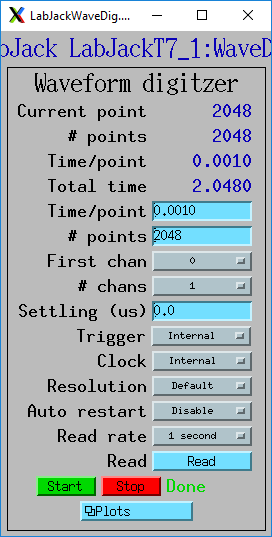

    **LabJackWaveDig.adl**

This is a plot of the waveform digitizer waveform for analog input 0 capturing 1000 samples/s (Dwell=0.001).

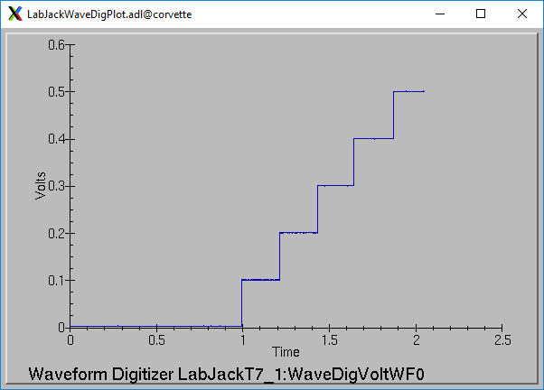

    **LabJackWaveDigPlot.adl**

Waveform Generator Functions
~~~~~~~~~~~~~~~~~~~~~~~~~~~~

These records are defined in the following files:
- LabJack_waveformGen.template. This database is loaded once per module.
- LabJack_waveformGenN.template. This database is loaded for each waveform generator output channel.

.. cssclass:: table-bordered table-striped table-hover
.. list-table::
  :header-rows: 1
  :widths: 10 10 10 10 60
  :align: left

  * - EPICS record name
    - EPICS record type
    - asyn interface
    - drvInfo string
    - Description
  * - $(P)WaveGenNumPoints
    - longin
    - asynInt32
    - WAVEGEN_NUM_POINTS
    - Number of points output waveform. The value of this record is equal to UserNumPoints
      if user-defined waveforms are selected, or IntNumPoints if internal predefined waveforms
      are selected.
  * - $(P)WaveGenUserNumPoints
    - longout
    - asynInt32
    - WAVEGEN_USER_NUM_POINTS
    - Number of points in user-defined output waveforms. This cannot be more than the
      value of maxOutputPoints that was specified in LabJackConfig.
  * - $(P)WaveGenIntNumPoints
    - longout
    - asynInt32
    - WAVEGEN_INT_NUM_POINTS
    - Number of points in internal predefined output waveforms. This cannot be more than
      the value of maxOutputPoints that was specified in LabJackConfig.
  * - $(P)WaveGenUserTimeWF
    - waveform
    - asynFloat32Array
    - WAVEDIG_USER_TIME_WF
    - Timebase waveform for user-defined waveforms. These values are calculated when UserDwell
      or UserNumPoints are changed. It is typically used as the X-axis in plots.
  * - $(P)WaveGenIntTimeWF
    - waveform
    - asynFloat32Array
    - WAVEGEN_INT_TIME_WF
    - Timebase waveform for internal predefined waveforms. These values are calculated
      when IntDwell or IntNumPoints are changed. It is typically used as the X-axis in
      plots.
  * - $(P)WaveGenCurrentPoint
    - longin
    - asynInt32
    - WAVEGEN_CURRENT_POINT
    - The current point being output. This does not always increment by 1 because the
      device can transfer data in blocks.
  * - $(P)WaveGenFrequency
    - ai
    - asynFloat64
    - WAVEGEN_FREQUENCY
    - The output frequency (waveforms/second). The value of this record is equal to UserFrequency
      if user-defined waveforms are selected, or IntFrequency if internal predefined waveforms
      are selected.
  * - $(P)WaveGenDwell
    - ai
    - asynFloat64
    - WAVEGEN_DWELL
    - The output dwell time or period (seconds/sample). The value of this record is equal
      to UserDwell if user-defined waveforms are selected, or IntDwell if internal predefined
      waveforms are selected.
  * - $(P)WaveGenDwellActual
    - ai
    - asynFloat64
    - WAVEGEN_DWELL_ACTUAL
    - The actual dwell time.  This can be different from the requested dwell time (WaveGenDwell) because of the granularity of the device clock.
  * - $(P)WaveGenUserDwell
    - ao
    - asynFloat64
    - WAVEGEN_USER_DWELL
    - The output dwell time or period (seconds/sample) for user-defined waveforms. This
      record is automatically changed if UserFrequency is modified.
  * - $(P)WaveGenIntDwell
    - ao
    - asynFloat64
    - WAVEGEN_INT_DWELL
    - The output dwell time or period (seconds/sample) for internal predefined waveforms.
      This record is automatically changed if IntFrequency is modified.
  * - $(P)WaveGenUserFrequency
    - ao
    - N.A.
    - N.A.
    - The output frequency (waveforms/second) for user-defined waveforms. This record
      computes UserDwell and writes to that record. This record is automatically changed
      if UserDwell is modified.
  * - $(P)WaveGenIntFrequency
    - ao
    - N.A.
    - N.A.
    - The output frequency (waveforms/second) for internal predefined waveforms. This
      record computes IntDwell and writes to that record. This record is automatically
      changed if IntDwell is modified.
  * - $(P)WaveGenTotalTime
    - ai
    - asynFloat64
    - WAVEGEN_TOTAL_TIME
    - The total time to output the waveforms. This is WaveGenDwellActual*NumPoints.
  * - $(P)WaveGenExtTrigger
    - bo
    - asynInt32
    - WAVEGEN_EXT_TRIGGER
    - The trigger source, "Internal" (0) or "External" (1). NOTE: NOT YET IMPLEMENTED,
  * - $(P)WaveGenExtClock
    - bo
    - asynInt32
    - WAVEGEN_EXT_CLOCK
    - The clock source, "Internal" (0) or "External" (1). If External is used then the
      Dwell record does not control the output rate, it is controlled by the external
      clock. However Dwell should be set to approximately the correct value if possible,
      because that controls the time axis on the plots.  NOTE: NOT YET IMPLEMENTED.
  * - $(P)WaveGenContinuous
    - bo
    - asynInt32
    - WAVEGEN_CONTINUOUS
    - Values are "One-shot" (0) or "Continuous" (1). This controls whether the device
      stops when the output waveform is complete, or immediately begins again at the start
      of the waveform.
  * - $(P)WaveGenRun
    - busy
    - asynInt32
    - WAVEGEN_RUN
    - Values are "Stop" (0) and "Run" (1). This starts and stops the waveform generator.
      In one-shot mode the waveform generator stops automatically when all of the samples have been output.
  * - $(P)WaveGenUserWF$(N)
    - waveform
    - asynFloat64Array
    - WAVEGEN_USER_WF
    - This waveform record contains the user-defined waveform generator data for channel
      N. The data are in volts. These data are typically generated by an EPICS Channel
      Access client.
  * - $(P)WaveGenInternalWF$(N)
    - waveform
    - asynFloat64Array
    - WAVEGEN_INT_WF
    - This waveform record contains the internal predefined waveform generator data for
      channel N. The data are in volts.
  * - $(P)WaveGenEnable$(N)
    - bo
    - asynInt32
    - WAVEGEN_ENABLE
    - Values are "Disable" and "Enable". Controls whether channel N output is enabled.
  * - $(P)WaveGenType$(N)
    - mbbo
    - asynInt32
    - WAVEGEN_WAVE_TYPE
    - Controls the waveform type on channel N. Values are 

      - "User-defined"
      - "Sin wave",
      - "Square wave"
      - "Sawtooth"
      - "Pulse"
      - "Random". 
      
      Note that if any channel is "User-defined" then all channels must be. 
      Note that all internally predefined waveforms are symmetric about 0 volts. 
      To output unipolar signals the Offset should be set to +-Amplitude/2.
  * - $(P)WaveGenPulseWidth$(N)
    - ao
    - asynFloat64
    - WAVEGEN_PULSE_WIDTH
    - Controls the pulse width in seconds if Type is "Pulse".
  * - $(P)WaveGenAmplitude$(N)
    - ao
    - asynFloat64
    - WAVEGEN_AMPLITUDE
    - Controls the amplitude of the waveform. For internally predefined waveforms this
      directly controls the peak-to-peak amplitude in volts. For user-defined waveforms
      this is a scale factor that multiplies the values in the waveform, i.e. 1.0 outputs
      the user-defined waveform unchanged, 2.0 increases the amplitide by 2, etc. For
      both internal and used-defined waveforms changing the sign of the Amplitude controls
      the polarity of the signal.
  * - $(P)WaveGenOffset$(N)
    - ao
    - asynFloat64
    - WAVEGEN_OFFSET
    - Controls the offset of the waveform in volts. For user-defined waveforms, this value
      is added to the waveform, i.e. 0.0 outputs the user-defined waveform unchanged,
      1.0 adds 1 volt, etc.

This is the medm screen for the waveform generator.

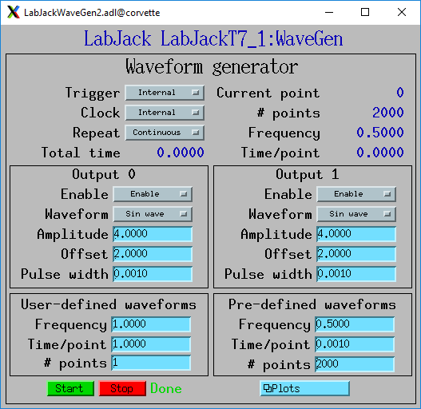

    **LabJackWaveGen2.adl**

This is a plot of an internal predefined sin wave waveform.

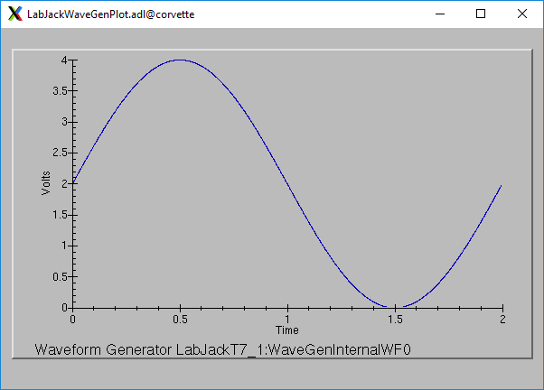

    **Plot of an internal predefined waveform (sin wave)**

--------------

| Suggestions and Comments to:
| `Mark Rivers <mailto:rivers@cars.uchicago.edu>`__ :
  (rivers@cars.uchicago.edu)
